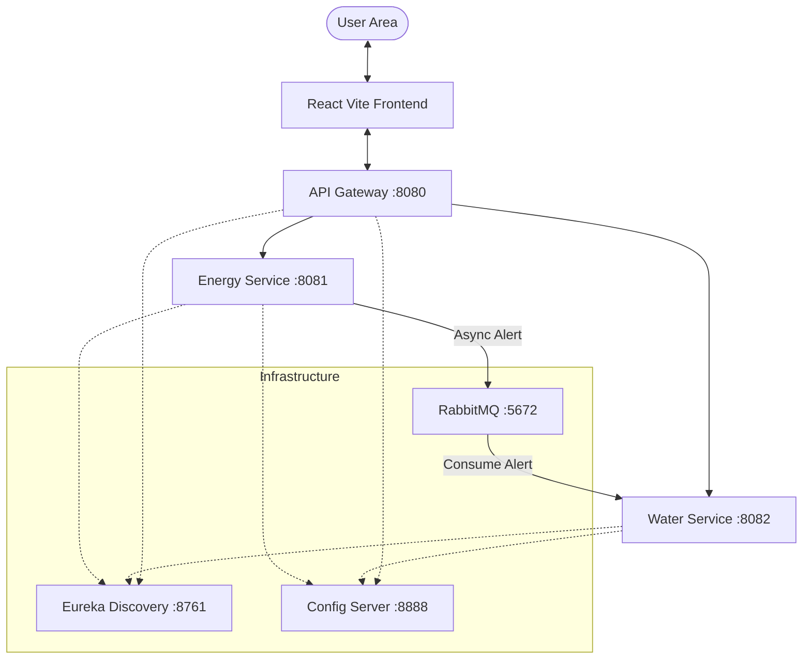

# 🚜 Irrigation Microservices System

A robust, scalable microservices architecture for managing farm irrigation, energy consumption, and water reserves. Built with **Spring Boot**, **React**, **Docker**, and **Kubernetes**.

---

## 🏗️ Architecture Overview

The system follows a modern microservices pattern with centralized configuration, service discovery, and an API Gateway.



### 🧱 Core Components
1.  **Discovery Service (Eureka)**: Handles service registration and discovery.
2.  **Config Service**: Centralized configuration using a local (native) repository.
3.  **Gateway Service**: Single entry point that routes requests to appropriate services.
4.  **Energy Service**: Manages pump statuses and energy consumption. Sends async alerts via RabbitMQ on surconsommation.
5.  **Water Service**: Manages reservoirs and consumes energy alerts to simulate water usage.
6.  **Irrigation Frontend**: React-based dashboard for real-time monitoring.

---

## 🛠️ Tech Stack
- **Backend**: Spring Boot 3+ (Java 17)
- **Frontend**: React (Vite, TailwindCSS)
- **Database**: SQLite (Local file persistence)
- **Messaging**: RabbitMQ
- **Config**: Spring Cloud Config
- **Containerization**: Docker & Docker Compose
- **Orchestration**: Kubernetes (Minikube)

---

## 🚀 Getting Started

### Prerequisites
- Java 17+
- Node.js 18+
- Docker & Docker Compose
- Minikube & Kubectl (for K8s deployment)
- `jq` (for simulation script)

### 🐋 Method 1: Docker (Fastest)
Run the entire stack with one command:
```bash
sudo ./run_docker.sh
```
This script handles building the images and starting the containers in the correct order.

### ☸️ Method 2: Kubernetes (Production-grade)
Use the automated startup script:
```bash
./start_k8s.sh
```
This script will:
1. Verify/Start Minikube.
2. Build images directly into the cluster.
3. Apply all K8s manifests.
4. Open the Frontend and Eureka dashboard automatically.

---

## 📊 Testing & Simulation

To test the system under load and trigger alerts, use the population script:
1. Ensure the app is running (Docker or K8s with port-forwarding).
2. Run:
```bash
./populate_data.sh
```
This creates pompes, reservoirs, and triggers surconsommation alerts.

---

## 🔧 Centralized Configuration
Configs are stored in `config-service/src/main/resources/config/`.
- `energy-service.properties`
- `water-service.properties`
- `gateway-service.yml`

Changes to these files are picked up by services on startup.

---

## 🆘 Troubleshooting

### 1. Port 5672 or 8080 already in use?
Kill the process occupying the port:
```bash
sudo fuser -k 5672/tcp
sudo fuser -k 8080/tcp
```

### 2. Stuck Docker Containers (Permission Denied)
If Docker refuses to stop a container even with sudo:
```bash
sudo systemctl restart docker
# If still stuck, reboot your machine.
```

### 3. Minikube Image Access
If pods have `ImagePullBackOff`, ensure you built images using `minikube image build` (already handled in `deploy_k8s.sh`).

---

## 🔗 Endpoints Summary
- **Frontend**: [http://localhost:3000](http://localhost:3000)
- **API Gateway**: [http://localhost:8080](http://localhost:8080)
- **Eureka Dashboard**: [http://localhost:8761](http://localhost:8761)
- **Config Server**: [http://localhost:8888](http://localhost:8888)
- **RabbitMQ Management**: [http://localhost:15672](http://localhost:15672) (guest/guest)
